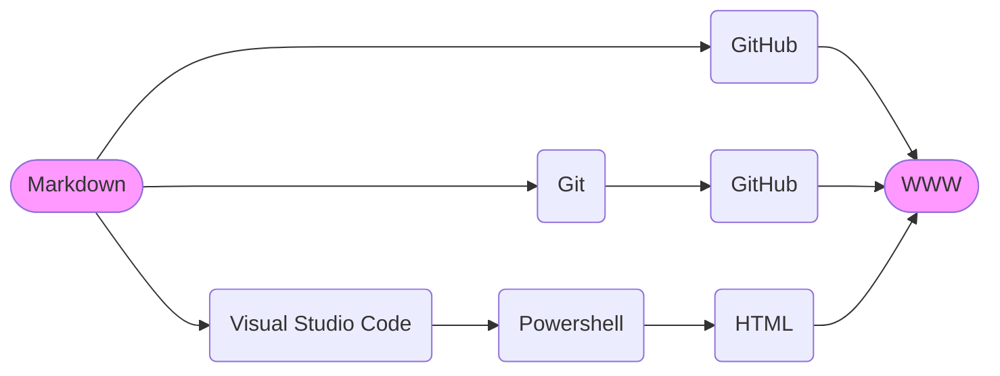

## Introduction

Hi. Here at GitHub I'm phdonner, but on most other platforms I use the signature pdonner. My native language is Swedish, but was born in Tampere, which is a predominantly Finnish city. Therefore most of us had bilingual competence as a gift. That's a good start in learning English, German, French, Spanish, Kiswahili... other languages.

I've been working in English speaking communities, but unidiomatic use of English will hopefully still be excused. If you have time to [write to me](https://github.com/phdonner/phdonner/blob/main/README.md#contact-information), you can be confident that politely expressed corrections will be most gratefully received.

---

## The village network cooperative

Right now my primary occupation is development of fiber optic network maintenance systems and tools. I'm doing more or less full-time voluntary work for our rural network cooperative: Kuhmon kyläverkko-osuuskunta (formerly Luoteis-Kuhmon kyläverkko-osuuskunta), which mainly operates in the north-western part of Kuhmo municipality, at the Russian border right on the middle latitude of Finland. 

Currently, the cooperative is preparing a smart rural project. Please study the cooperative's [Smart Rural 27 pages](https://nettinoste.fi/wp/category/smart-rural-27/), in case you would like to have a look at the preparatory work that we have been doing. The pages are a mix of Finnish and English content, but most often with summaries in both directions. Internationalism and [multilingual methods](https://github.com/phdonner/phdonner/blob/main/markdown.md#multilingual-markdown) are actually vital themes of this site.

---

## The information society

Our project is based on the assumption that we are experiencing the first phases of an emerging new mode of production. In the _information society_, many or perhaps most aspects of production are dependent on information technology. Rural inhabitants in our environment don't want to be spectators of that process, but active agents. Deep understanding and early adoption of the new tools of production can be an asset in rural, scarcely populated environments.

Market driven production creates unnecessary expenses, These are often motivated by IT expenses and the desire of producing a surplus for the investors. Think of the quickly growing bank fees. Often concrete production costs are obscured by abstract concepts like digitization or artificial intelligence. At the same time some of the most potential advantages of information society construction - first of all automation - remain unused. Here the focus is reversed. The project stresses the importance of simple, but effective IT tools and bottom-up and peer oriented collaboration as inroads on the way towards the zero margin society.

### 📚 References on the information society

_Zero Marginal Cost Society: The Internet of Things, the Collaborative Commons, and the Eclipse of Capitalism_  
by Jeremy Rifkin, 2015.

---

## How can Markdown documents be rendered and published on the World Wide Web?

This is a personal undertaking which contributes to the NOSTERIIHI smart rural development project. I would certainly like to collaborate with other developers, who are willing to contribute in transforming automation into a way of empowering rural developers. It could be important to state an example of how bottom-up oriented, open-source voluntary collaboration can be a smart concept which wins over passivating, profit-based top-down oriented work. Welcome to the zero-margined collaborative community.

It could be practical to start quite modestly by producing a straightforward case, which would prove that there is nothing very mystical about automation and that the information society provides us with productive tools, without resorting to artificial income logic. The production of web pages has been a rather complicated and error prone process. Markdown is a notation procedure which was invented in the early years of the millenium. However, it is only during the last few years that the technique has become widely popular among developers. One of the reasons, is that GitHub and some other developer resources adopted Markdown as a resource for quick production of Web pages. That is how a couple of resources were aligned to support the process of transforming Markdown to HTML.
 
This small NOSTERIIHI sub-project will gradually evolve into a bilingual tutorial on methods of setting up a low-cost computer environment, which enables rural developers to produce HTML pages for use in the WWW. This task will be achieved without resorting to commercial services, such as Facebook or WhatsApp. Let's see where the project takes us.

<!-- Follow up with a breakdown of the basic concepts:   -->
<!-- HTML the marking language to make WWW pages         -->
<!-- TCP/IP HTTPMediator                                 -->
<!-- Markdown: A simple marking language                 -->
<!-- Automation tools: Git                               -->
<!-- The GitHub developer resource                       -->
<!-- Automation tools: PowerShell                        -->
<!-- VisualStudio Code                                   -->
<!-- My COM tool                                         -->

---

## The workflow

Planning is a conceptual activity. To be efficient, we could outline of the various workflows which can be followed in order to arrive at a solution. The following diagram will hopefully guide our work. 

<!-- Also indicate various other output alternatives: WWW, Slide show, PDF, Email etc -->

<!-- Find out how the Mermaid nodes could be activated to become hyperlinks           -->

If you are curious to know how the above diagram was designed, check out the Markdown subtopic on [Mermaid](markdown.md#mermaid-diagrams-a-way-of-visualizing-conceptual-frameworks), which is a free diagram design and rendering tool. 

The next subheadings are a list of some of the topics and immediate tasks that we are facing right now.

---

## Markdown

Although Markdown is easy to learn, it can still become a rather powerful resource in information society construction. This is how the author of Markup, John Gruber describes the philosophy behind the language:

> Markdown is intended to be as easy-to-read and easy-to-write as is feasible.  
> Readability, however, is emphasized above all else. A Markdown-formatted document should be publishable as-is, as plain text, without looking like it’s been marked up with tags or formatting instructions. 

Apart from providing ways of organizing the content of individual documents, it is handy in preparing web pages, writing email, making task lists and so forth. [Learn 10 basic notations](https://www.markdownguide.org/basic-syntax/) and you will quickly discover a number of real life applications. Have a look at the [GitHub Markdown sample page](https://gist.github.com/rt2zz/e0a1d6ab2682d2c47746950b84c0b6ee) and push the 'Raw' button to see what the source looks like.

However, you should notice that the two resources - Markdown and HTML - serve diverse ends: Markdown provides a quick way of structuring documents. HTML provides, on the other hand, all the bells and whistles needed to produce a print-ready document. Don't think that we are advocating the sole use of Markdown. The two approaches can, in fact, support one another.

Please, have a closer look at the details of this topic by navigating the [Markdown page](markdown.md) of the NOSTERIIHI project.

### 🔗 Links to Markdown articles

[John Gruber's Markdown introduction on his Daring Fireball site](https://daringfireball.net/projects/markdown/)

[Markdown Guide](https://www.markdownguide.org/getting-started/)  
by Matt Cone

[Markdown tutorial](https://www.markdowntutorial.com/)
<!-- Tarjoaa localisoitua sisältöä. Tuota suomenkielinen versio -->

### 📚 References on Markdown

_The Markdown Guide_  
by Matt Cone, 2020.

_Using Markdown: A Short Instruction Guide_  
by William Dyer, 2018.

---

## Git and GitHub

*Git* is the command language for the safe creation and maintenance of documents. It provides a safe and elegant mechanism for _version control_ and hides the many stages of updating the documents in an invisible document of the file system. By documenting the various stages of the update history, the user will be able to easily retrieve earlier versions. _Collaboration_ is an other aspect of the development process that Git facilitates. Developers can work concurrently on various aspects of the content without the risk of colliding updates.

*GitHub* is a free resource where developers of open-source code and documents can create and share new content. By paying a modest yearly fee, developers get access to a number of extra features which are not available to the ordinary registered user. There or other similar services with varying focus. 

At GitHub I’m currently trying to discover how Git, GitHub and related open-source tools and services could be beneficial in information society construction. 

### 🔗 Links to Git and GitHub articles

[Git and GitHub Tutorial – Version Control for Beginners](https://www.freecodecamp.org/news/git-and-github-for-beginners/)
by Ihechikara Vincent Abba

[Git Tutorial](https://www.w3schools.com/git/)  
at w3schools.com

[Git GitHub Getting Started](https://www.w3schools.com/git/git_remote_getstarted.asp)  
at w3schools.com

### 📚 References on Git and GitHub

_GIT GITHUB Programming in 8 Hours, For Beginners_  
by Ray Yao, 2021.

---

## Markdown WWW pages at GitHub

There is a special section of GitHub, located at pages.github.com which is dedicated to WWW publication. Navigate to the [GitHub pages](https://pages.github.com/) where you can find a tutorial which introduces the ways of constructing a site for your personal use or for your organization. Alternatively the pages can become a forum for your project.

https://github.com/phdonner/ is an experimental site. So please, don't expect that the content would be static somehow. On the contrary: If the structure and the content develops dynamically, then that could be taken as a sign of active and perhaps even productive work.

### 🔗 Links to Markdown WWW pages at pages.github.com

[GitHub pages](https://pages.github.com/)

---

## Visual Studio Code

Before the appearance of the open-source Linux operating system, Microsoft Windows was by far the most appealing platform for software developers. With a low license fee the entrance threshold was low. With the so called COM-based technologies MS made a leap into easy-going development of automated systems. Dependency on proprietary arrangements is, however, in the long run a stumbling block for any non-profit oriented developer. Therefore, the initiative to place both the Visual Studio Integrated Development Environment (IDE) and the PowerShell scripting environment into the domain of open-source and cross-platform development were most welcome moves.

Visual Studio is an extensible tool written by developers for the developer community. This implies that there is a plentitude of extensions. It is interesting to note, that many of them promote Markdown functionality. Here are a few examples of the kind advantages that you can achieve:

- [ ] Create a slide show or a presentation from Markdown code and the Marp extension <!-- Add pointers to each of these extensions -->
- [x] Make a Markdown compatible diagram with the Mermaid extension
- [ ] Convert your Markdown document to PDF

> [!TIP]
> If you are already a registered GitHub user, you can experience the functionality of Visual Studio Code by replacing the `.com` root of your GitHub repository web address with `.dev`. Like this: Change github.com/`<your GitHub name>` to github.dev/`<your GitHub name>`. This loads the contents or your page into a browser version of Visual Studio Code.

### 📹 Tutorial videos on use of Markdown with Visual Studio Code

[Note Taking with VS Code & Git](https://www.youtube.com/watch?v=Hgucu1ch3mo)  
by Reynald Adolphe‬.

---

## Render and transform Markdown into HTML with PowerShell 

PowerShell is a scripting language created by developers at Microsoft, but nowadays maintained by an open-source community. A quite remarkable change of focus came about when this undertaking shook off its roots and turned into a cross-platform language, which is nowadays available for Windows, Apple and Linux operating systems. Raspberry OS support was initially experimental, but since some time our installations have been quite stable. As an extension to the Visual Studio Code integrated development environment, PowerShell has become a viable tool for users and administrators with automation needs (perhaps even on a cross-platform basis).

Check out the details by delving into the [PowerShell section](powershell.md) of this introduction.

### 🔗 Links to PowerShell documentation

[PowerShell Documentation](https://learn.microsoft.com/en-us/powershell/)
at learn.microsoft.com.

<!-- Add a list of the best tutorials -->

### 📚 References on PowerShell

_Windows PowerShell Cookbook 2e_  
by Lee Holmes, 2010.

---

## Contact information

This is how you should be able to reach me: Try pdonner at the cooperative's nettinoste.fi domain. There is a lot of spam among those mails, but I'm reading the messages of that post office once or twice every week. 

<!---
phdonner/phdonner is a ✨ special ✨ repository because its `README.md` (this file) appears on your GitHub profile.
You can click the Preview link to take a look at your changes.
--->
