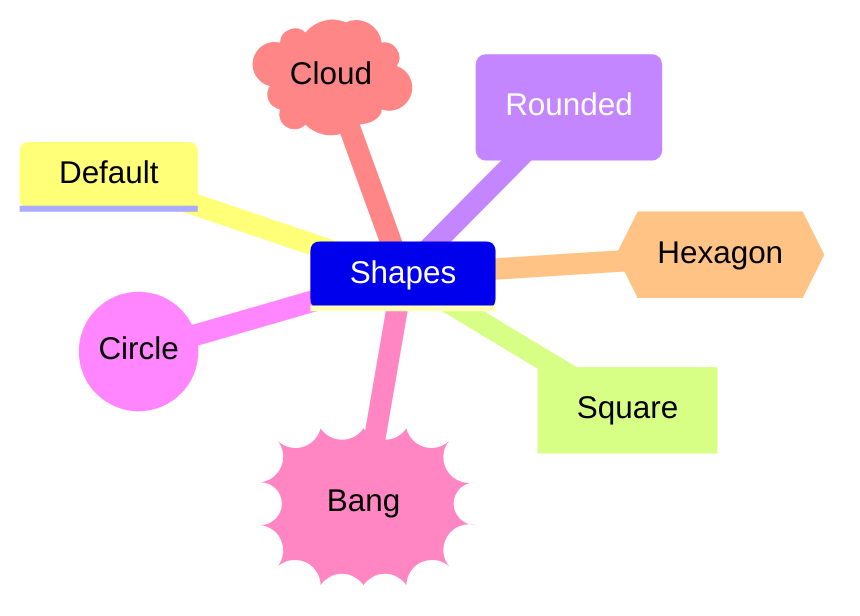

## Introduction

Hi. At GitHub I'm phdonner, but on most other platforms I use the signature pdonner. My native language is Swedish, but I was born in Tampere which is a predominantly Finnish city. Therefore most of us had bilingual competence as a gift. That's a good start in learning English, German, French, Spanish, Kiswahili... many languages.

I've been working quite a lot in English speaking communities, but unidiomatic use of English will hopefully still be excused. If you have time to [write to me](https://github.com/phdonner/phdonner/blob/main/README.md#contact-information), you can be confident that politely expressed corrections will be most gratefully received.

---

## The village network cooperative

Right now my primary occupation is development of fiber optic network maintenance systems and tools. I'm doing more or less full-time voluntary work for our rural network cooperative: Luoteis-Kuhmon kyläverkko-osuuskunta. The cooperative is preparing a smart rural project. Please study the cooperative's [Smart Rural 27 pages](https://nettinoste.fi/wp/category/smart-rural-27/), in case you would like to have a look at the preparatory work that we have been doing. The pages are a mix of Finnish and English content, but most often with summaries in both directions.

Planning is a conceptual activity. To be effective, we are trying to outline a workflow which will guide our work. The next subheadings are a list of some of the topics and immediate tasks that we are facing right now.  

```mermaid
graph TD;
(Visual Studio Code) --> (Git and GitHub) --> (Markdown) --> (PowerShell) --> (HTML)

```
---

## Git and GitHub

Here at GitHub I’m currently trying to discover how Git, GitHub and related open source tools and services could be beneficial in information society construction. This is an experimental site. So please, don't expect that the content would be static somehow. On the contrary: If the structure and the content develops dynamically, then that could be taken as a sign of active and perhaps even productive work.

---

## Markdown

Our project is based on the assumption that we are experiencing the first phases of an emerging mode of production. In the information society, the major aspects of production are dependent on information technology. We don't want to be spectators of that process, but active agents. Deep understanding and early adoption of the new tools can be an asset in rural, scarcely populated environments.

Markdown is an asset in information society construction. Apart from providing ways of organizing the content of individual documents, it is very handy in preparing web pages, writing email, making task lists and so forth. [Learn the 10 basic notations](https://www.markdownguide.org/basic-syntax/) and you will quickly discover quite a number of real life applications.

---

## Comments in Markdown

One of the first observations I made while outlining the concept framework, was the fact that the author of the language hadn't provided a way of commenting Markdown content. It could be useful to have a way of jotting down preliminary thoughts, interesting sources and of course comments to be remembered by the author, but which wouldn't be shown to readers of the rendered document. There is an [interesting discussion on this topic](https://stackoverflow.com/questions/4823468/comments-in-markdown) at the Stack Overflow site which could be followed up by further debate and additional experiments.

---

## Multilingual Markdown

In line with earlier work, the tutorial will be published at least in English and Finnish. This is not a unique undertaking, but the aim presents a couple of challenges. It is assumed that this problem has already been tackled in the GitHub community. After assessing those solutions, an attempt will be made to define a set of good practices to be used in other aspects of the project. Perhaps we will be able to reproduce the content in other languages, as well.

---

## Emoji fonts in Markdown and on WWW pages

When I started this README I received a lot of redundant images, which looked like emoji ;) symbols. It would, however, be nice to know where all these decorative characters are coming from: 😕 👔 👗 👋 🌱 🐶 🌼 🌻. OK, some of them are provided with Microsoft Windows 11 Segoe UI Emoji font and similar projects (cf. [Emoji Objects](https://emojipedia.org/objects), [Open Source OpenMoji](https://openmoji.org/) contains literally thousands of them). 

As you can see: Here at GitHub the emoji characters can be embedded straight into the Markdown source document. For the time being, these fonts aren't apparently portable out of the box. While experimenting with this interesting resource you may discover that the characters are sometimes rendered with colors, and sometimes in black and white. The meaning of some of the mini sized images may be a bit difficult to figure out. Therefore mastering Markdown font sizes matters. Meanwhile, we should also validate that our solution renders Emoji characters correctly in other environments, outside GitHub.

---

## Mermaid diagrams in Visual Studio Code and on GitHub

GitHub supports a convenient Markdown inspired way of creating the mindmaps needed during our planning. It is called *Mermaid*. You can design diagram in many flavors: mindmaps, flow charts, sequence diagrams, Git Graphs etc.. Again, many of the mermaid notations are rather easy to learn. Study the markdown code behind the example diagram by copying it to text processor and you'll see that the basic symbols are quite easy to learn.



This diagramming and charting functionality depends on JavaScript. In order to use such mindmaps outside GitHub, we would need to know how the package is installed on the local machine and on our web server.

---

## PowerShell and Visual Studio Code

PowerShell is a scripting language created by developers at Microsoft, but nowaday maintained by an open source community. A quite remarkable change of focus came about when this undertaking shaked off its roots and turned inte a crossplatform language, which is nowadays available for Windows, Apple and Linux operating systems. Raspberry OS support was initially experimental, but since some time our installations have been quite stable. As an extension to the Visual Studio Code integrated development environment, PowerShell has become a viable tool for users and administrators with cross-platform needs.

---

## Convert Markdown to HTML with PowerShell

I would like to collaborate with others willing to contribute in development of PowerShell automation as a way of empowering rural developers. We would like to state an example how bottom-up oriented, open source voluntary collaboration can be a smart concept which wins over passivating, profit-based top-down work. Here I'll start quite modestly by producing a bilingual tutorial on methods of setting up a low-cost computer environment, which enables rural developers to produce HTML pages. This task will be achieved without resorting to commercial services, such as Facebook or WhatsApp. Let's see where the project takes us.

---

## Contact information

This is how you should be able to reach me: Try pdonner at the cooperative's nettinoste.fi domain. There is a lot of spam among those mails, but I'm reading the messages of that post office once or twice every week. 

<!---
phdonner/phdonner is a ✨ special ✨ repository because its `README.md` (this file) appears on your GitHub profile.
You can click the Preview link to take a look at your changes.
--->
