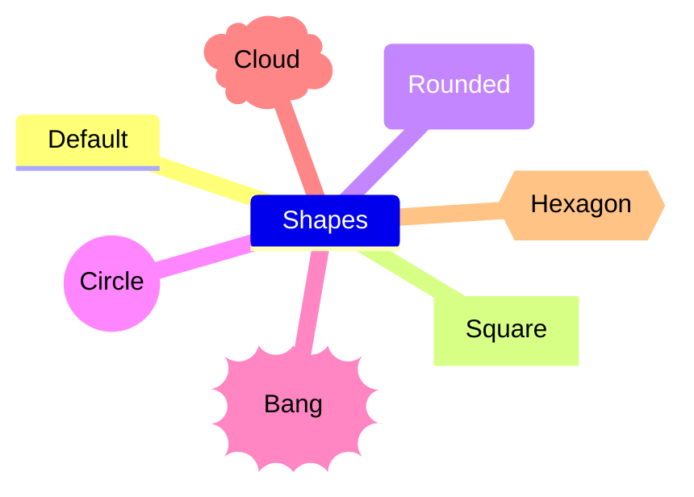

# NOSTERIIHI Markdown

Although Markdown is easy to learn, it can still become a powerful resource in information society construction. This is how the author of Markup, John Gruber describes the philosophy behind the language:

> Markdown is intended to be as easy-to-read and easy-to-write as is feasible.  
> Readability, however, is emphasized above all else. A Markdown-formatted document should be publishable as-is, as plain text, without looking like it’s been marked up with tags or formatting instructions. 

Apart from providing ways of organizing the content in individual documents, it is handy in preparing web pages, writing email, making task lists and so forth. [Learn 10 basic notations](https://www.markdownguide.org/basic-syntax/) and you might quickly discover a number of real life applications. Have a look at the [GitHub Markdown sample page](https://gist.github.com/rt2zz/e0a1d6ab2682d2c47746950b84c0b6ee) and push the 'Raw' button to see what the Markdown source document looks like.

However, you should notice that the two resources - Markdown and HTML - serve diverse ends: Markdown gives us a quick way of organizing the structure of documents. HTML provides, on the other hand, all the bells and whistles needed to produce a print-ready document. Don't think that we are advocating the sole use of Markdown. You will see that the two approaches can, in fact, support one another.

Please, have a closer look at the details of this topic by navigating the [Markdown page](markdown.md) of the NOSTERIIHI project.

### 🔗 Links to Markdown web resources

[Markdown](https://daringfireball.net/projects/markdown/)  
by John Gruber, 2004.

[Markdown Guide](https://www.markdownguide.org/getting-started/)  
by Matt Cone

[Markdown tutorial](https://www.markdowntutorial.com/)
<!-- Tarjoaa localisoitua sisältöä. Tuota suomenkielinen versio -->

[Markdown best practices](https://learn.microsoft.com/en-us/powershell/scripting/community/contributing/general-markdown)  
at learn.microsoft.com

### 📚 References on Markdown

_The Markdown Guide_  
by Matt Cone, 2020.

_Using Markdown: A Short Instruction Guide_  
by William Dyer, 2018.

<!-- There should be a subtopic on use of Markdown in the WordPress environment  -->
<!-- There is a multitude of WordPress plugins which supports the use of         -->
<!-- Markdown in the WordPress: 57 (15.05.2024)                                  -->
<!-- They should be evaluated                                                    -->

[NOSTERIIHI introduction to Markdown](https://github.com/phdonner#markdown)  
at github.com

---

## Text to HTML

In 2004 the author developed a server side Visual Basic Script utility to facilitate production of valid HTML pages for ongoing subprojects on the [Virtuosi project site](http://www.znak.fi/user/pdonner/). The tool [TextToHTML](http://www.znak.fi/user/pdonner/private/texttohtml.asp) included a number of shorthand markings for various HTML functions: paragraphs, lines, ordered and unordered lists, horizontal rules, hyperlinks etc. You can have look at the [features of the original TextToHtml tool](http://www.znak.fi/user/pdonner/private/TextToHTML_EN.htm).

The TextToHtml utility was a necessity for speedy HTML page production in documenting ongoing work. I wasn't aware of the fact that John Gruber created in the same year a fully featured and carefully designed language called Markdown with related tools and documentation. The name of the language was perhaps selected to contrast it with the Hypertext _Markup_ Language, HTML wich was much more detailed and the syntax was evidently more detailed. 

---

## Aims of the Markup section of the NOSTERIIHI project

While providing the fundamentals of the procedures of writing Markup documents, we will also delve into some special topics of Markup which can be useful in making Information Society construction a trend in rural development and other collaborative efforts.

### 📋 Tasks

Here are some of the topics to be covered:

- [x] [Comments in Markdown](#comments-in-markdown)
- [ ] [Multilingual Markdown](#multilingual-markdown)
- [x] [Emoji fonts in Markdown and on WWW pages](#emoji-fonts-in-markdown-and-on-www-pages)
- [x] [Mermaid diagrams: A way of visualizing conceptual frameworks](#mermaid-diagrams-a-way-of-visualizing-conceptual-frameworks)

---

## Comments in Markdown

One of the first observations I made while outlining the conceptual framework, was the fact that the author of the Markdown language hadn't provided a way of commenting Markdown content. 

It could be useful to be able to jot down preliminary thoughts, interesting sources - and of course comments. They should be easily accessible to be remembered by the author, while not immediately visible to readers of the rendered document. There is an interesting [ongoing discussion on this topic](https://stackoverflow.com/questions/4823468/comments-in-markdown) at the Stack Overflow site which could be followed up by further debate and additional experiments.

    <!-- This is a HTML comment. It seems to be a functional workaround to make comments in Markdown. -->

<!-- This is a HTML comment. It seems to be a functional workaroundto make comments in Markdown.      -->

<!-- Have a look at Rich Tabor's Comment plugin for WordPress                                         -->

<!-- Also consider [comment]: # notation, see                                                         -->
<!-- https://github.com/mattcone/markdown-guide/blob/master/hacks.md#comments                         -->

---

## Multilingual Markdown

In line with earlier work, the tutorial will be published at least in English and Finnish. This is not a unique undertaking, but the aim presents a couple of challenges. It is assumed that this problem has already been tackled in the GitHub community. After assessing those solutions, an attempt will be made to define a set of good practices to be used in other aspects of the project. Perhaps we will be able to reproduce the content in other languages, as well.

### 📋 Tasks

- [ ] Create a Finnish version of the NOSTERIIHI project site
- [ ] Create an English version of the preparatory NOSTERIIHI project outline
- [ ] Implement an internationalized subdomain name system suitable for Finnish villages

---

## Emoji fonts in Markdown and on WWW pages

When I started this README I received a lot of redundant images, which looked like emoji ;) symbols. It would, however, be nice to know where all these decorative characters are coming from: 😕 👔 👗 👋 🌱 🐶 🌼 🌻. Some of them are provided with Microsoft Windows 11 Segoe UI Emoji font and similar resources (cf. [Emoji Objects](https://emojipedia.org/objects), [Open Source OpenMoji](https://openmoji.org/) contains literally thousands of them). These emoji characters could be meaningful in the context of our project:

* 📚 Literature
* 📹 Video content
* 🔗 References
* 📋 Tasks

As you can see: Here at GitHub the emoji characters can be embedded straight into the Markdown source document. For the time being, these fonts aren't apparently portable out of the box. While experimenting with this interesting resource you may discover that the characters are sometimes rendered with colors, and sometimes in black and white. The meaning of some of the mini sized images may be a bit difficult to figure out. Therefore mastering Markdown font sizes matters. Meanwhile, we should also validate that our solution renders Emoji characters correctly in other environments, outside GitHub.

---

## Mermaid diagrams: A way of visualizing conceptual frameworks

GitHub supports a convenient Markdown inspired way of creating the mindmaps needed during our planning. It is called *Mermaid*. You can design diagram in many flavors: flow charts, mindmaps, sequence diagrams, Git Graphs etc.. Again, many of the Mermaid notations are rather easy to learn (cf. the [Mermaid cheat sheet](https://jojozhuang.github.io/tutorial/mermaid-cheat-sheet/) at the Jekyll site). There is free and handy design tool called  [Mermaid Live Editor](https://mermaid.live). Study the markdown code behind the example diagram by copying it to text processor. You'll see that the basic symbols are quite easy to learn.

This diagramming and charting functionality depends on a programming resource called JavaScript. In order to use such mindmaps outside GitHub, we would need to know how the Mermaid package is installed on the local machine and on our web server.

 ### 📋 Tasks

- [ ] Find a way of activating Mermaid nodes on GitHub
- [ ] Hide the GitHub Mermaid view control box

<!-- The first matter is being developed on two GitHub discussion threads:  -->
<!-- https://github.com/orgs/community/discussions/46096                    -->
<!-- https://github.com/orgs/community/discussions/106690                   -->

<!-- For the second one check my notes                                       -->

### 📚 References on Mermaid
_The Official Guide to Mermaid.js: Create complex diagrams and beautiful flowcharts easily using text and code_  
by Knut Sveidqvist and Ashish Jain
