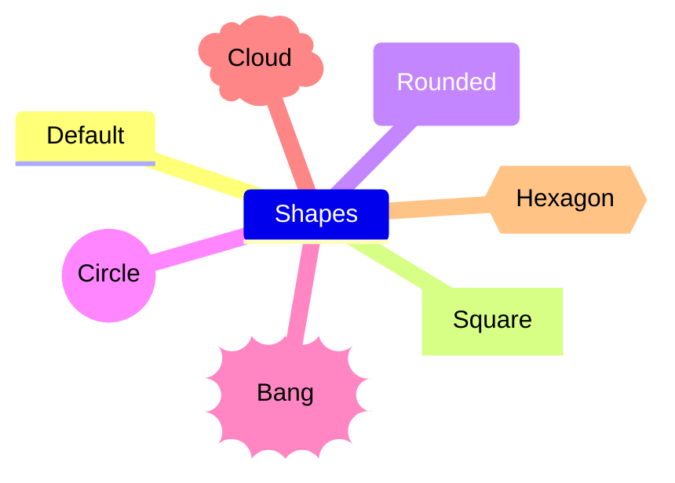

# NOSTERIIHI Markdown

The NOSTERIIHI project selected quick production of HTML pages as a test case of presenting collaborative information society procedures; how to design open-source tools, man made assets of the Information Society. While also being conceptual in essence, they provide a concrete starting point to understand what Information society construction is all about. This is in contrast with the abstract and mystified reality currently described as digitisation and artificial intelligence. 

---

## Text to HTML

The author developed in 2004 a Visual Basic Script utility to facilitate production of valid HTML pages for ongoing subprojects on the [Virtuosi project site](http://www.znak.fi/user/pdonner/). The tool [TextToHTML](http://www.znak.fi/user/pdonner/private/texttohtml.asp) included a number of shorthand markings for various HTML functions. You can have look at the [features of the original TextToHtml tool](http://www.znak.fi/user/pdonner/private/TextToHTML_EN.htm).

The TextToHtml utility was a necessity for speedy HTML page production. I wasn't aware of the fact that John Gruber created in the same year a fully featured and carefully designed language called Markdown with related tools and documentation. The name of the language was perhaps selected to contrast it with the Hypertext Markup Language, HTML wich was much more detailed and the syntax was evidently much more complicated. 

However, you should notice that the two resources serve diverse ends: Markdown provides a quick way of structuring documents. HTML provides, on the other hand, all the bells and whistles needed to produce a print-ready document. Don't think that we are advocating the sole use of Markdown. As you will soon find out, the two approaches can support one another.

---

## Aims of the Markup section of the NOSTERIIHI project

While providing the fundamentals of the procedures of writing Markup documents, we will also delve into some special topics of Markup which can be useful in making Information Society construction a trend in rural development and other collaborative efforts.

Here are some of the topics to be covered:

* [Comments in Markdown](#comments-in-markdown)
* [Multilingual Markdown](#multilingual-markdown)
* [Emoji fonts in Markdown and on WWW pages](#emoji-fonts-in-markdown-and-on-www-pages)
* [Mermaid diagrams: A way of visualizing conceptual frameworks](#mermaid-diagrams-a-way-of-visualizing-conceptual-frameworks)

---

## Comments in Markdown

One of the first observations I made while outlining the concept framework, was the fact that the author of the language hadn't provided a way of commenting Markdown content. 

It could be useful to to be able to jot down preliminary thoughts, interesting sources - and of course comments. They should be easily accessible to be remembered by the author, while not immediately visible to readers of the rendered document. There is an [interesting discussion on this topic](https://stackoverflow.com/questions/4823468/comments-in-markdown) at the Stack Overflow site which could be followed up by further debate and additional experiments.

---

## Multilingual Markdown

In line with earlier work, the tutorial will be published at least in English and Finnish. This is not a unique undertaking, but the aim presents a couple of challenges. It is assumed that this problem has already been tackled in the GitHub community. After assessing those solutions, an attempt will be made to define a set of good practices to be used in other aspects of the project. Perhaps we will be able to reproduce the content in other languages, as well.

---

## Emoji fonts in Markdown and on WWW pages

When I started this README I received a lot of redundant images, which looked like emoji ;) symbols. It would, however, be nice to know where all these decorative characters are coming from: 😕 👔 👗 👋 🌱 🐶 🌼 🌻. OK, some of them are provided with Microsoft Windows 11 Segoe UI Emoji font and similar projects (cf. [Emoji Objects](https://emojipedia.org/objects), [Open Source OpenMoji](https://openmoji.org/) contains literally thousands of them). 

As you can see: Here at GitHub the emoji characters can be embedded straight into the Markdown source document. For the time being, these fonts aren't apparently portable out of the box. While experimenting with this interesting resource you may discover that the characters are sometimes rendered with colors, and sometimes in black and white. The meaning of some of the mini sized images may be a bit difficult to figure out. Therefore mastering Markdown font sizes matters. Meanwhile, we should also validate that our solution renders Emoji characters correctly in other environments, outside GitHub.

---

## Mermaid diagrams: A way of visualizing conceptual frameworks

GitHub supports a convenient Markdown inspired way of creating the mindmaps needed during our planning. It is called *Mermaid*. You can design diagram in many flavors: flow charts, mindmaps, sequence diagrams, Git Graphs etc.. Again, many of the Mermaid notations are rather easy to learn (cf. the [Mermaid cheat sheet](https://jojozhuang.github.io/tutorial/mermaid-cheat-sheet/) at the Jekyll site). There is free and handy design tool called  [Mermaid Live Editor](https://mermaid.live). Study the markdown code behind the example diagram by copying it to text processor. You'll see that the basic symbols are quite easy to learn.

This diagramming and charting functionality depends on a programming resource called JavaScript. In order to use such mindmaps outside GitHub, we would need to know how the Mermaid package is installed on the local machine and on our web server.

# 📚
_The Official Guide to Mermaid.js: Create complex diagrams and beautiful flowcharts easily using text and code_  
by Knut Sveidqvist and Ashish Jain
